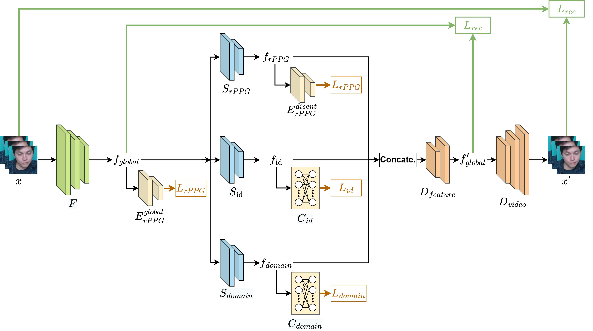
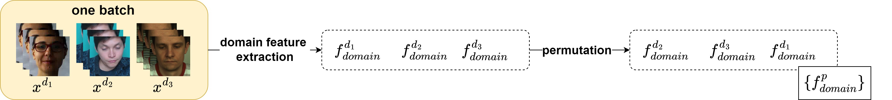
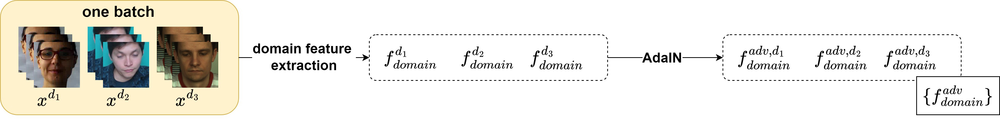

# DG-rPPGNet

This repository is the official implementation of *Domain Generalized RPPG Network: Disentangled Feature Learning with Domain Permutation and Domain Augmentation* that has been accepted to ACCV 2022.
[Domain Generalized RPPG Network: Disentangled Feature Learning with Domain Permutation and Domain Augmentation.](https://openaccess.thecvf.com/content/ACCV2022/html/Chung_Domain_Generalized_RPPG_Network_Disentangled_Feature_Learning_with_Domain_Permutation_ACCV_2022_paper.html) (Oral) </br>

## Description

We propose a DG-rPPGNet to generalize the rPPG estimation with different domains.

The proposed DG-rPPGNet including the disentanglement network, domain permutation strategy and augmented domain generalization strategy

## Framework


## Domain permutation


## Domain augmentation


## Implementation

The DG-rPPGNet and the rPPG estimator were trained with Nvidia RTX 2080 and RTX 3080.

## Contributing

If you find this work useful, consider citing our work using the following bibTex:
```
@inproceedings{chung2022domain,
  title={Domain Generalized RPPG Network: Disentangled Feature Learning with Domain Permutation and Domain Augmentation},
  author={Chung, Wei-Hao and Hsieh, Cheng-Ju and Liu, Sheng-Hung and Hsu, Chiou-Ting},
  booktitle={Proceedings of the Asian Conference on Computer Vision},
  pages={807--823},
  year={2022}
}
```

